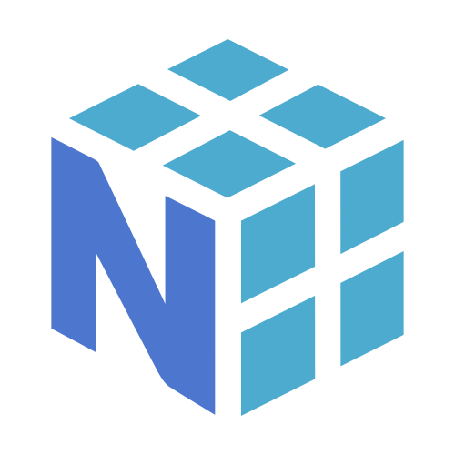
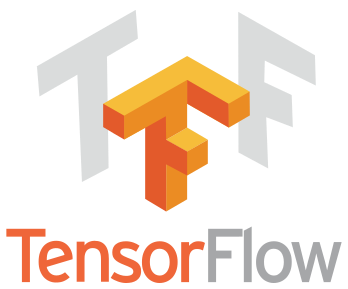

# 導入

## ■ はじめに
このページではPythonやその周辺に関する説明を行います．

## ■ Pythonとは
プログラミング言語「Python（パイソン）」とは，
[Python Software Foundation](https://www.python.org/) が中心となって開発されてきた，
読みやすさと書きやすさを重視する汎用プログラミング言語です．
Web開発，データ分析，機械学習，自動化，組込み，科学技術計算など，非常に幅広い用途で使われています．

文法が比較的素直で，「まず動くものを書いてから少しずつ改良する」という流れと相性が良いです．
その一方で，標準ライブラリや外部パッケージが充実しているため，
入門向けの言語でありながら，実務でも研究でも主役になれるのが強みです．

### ■ Pythonを使ってできること
- データ分析:
  [NumPy](https://numpy.org/)，
  [pandas](https://pandas.pydata.org/)，
  [Matplotlib](https://matplotlib.org/) などを使って
  数値計算や可視化ができます．
- 機械学習・深層学習:
  ニューラルネットワーク・深層学習ならば
  [PyTorch](https://pytorch.org/) や
  [TensorFlow](https://www.tensorflow.org/) を用いて実装ができます．これらを使うとGPUやTPUを用いた高速化の恩恵も受けられます．また，それ以外の機械学習手法ならば
  [scikit-learn](https://scikit-learn.org/) に多数の実装が収録されています．
  
- Web開発:
  [FastAPI](https://fastapi.tiangolo.com/) や
  [Django](https://www.djangoproject.com/) により
  APIやWebアプリケーションを作れます．
- 自動化:
  ファイル操作，データ整形，Webスクレイピング，
  研究用の実験補助などを少ないコードで実装できます．
- 教育:
  文法が平易で，実行結果をすぐ確認しやすいため，
  プログラミング教育でも広く採用されています．

### □ 様々なPython実装
[Python](https://www.python.org/download/alternatives/) には
複数の実装があります．
「Pythonの文法をどの処理系で動かすか」が異なるだけで，
同じPythonコードでも内部の動作や得意分野が変わります．

#### □ CPython
[CPython（シーパイソン）](https://www.python.org/) はデフォルトのPython実装です．
その名の通り，インタプリタの主要部分がC言語で書かれています．
普段「Python」と言ったとき，多くの場合はこのCPythonを指しています．

実行速度はCやRustのようなコンパイル言語には及びませんが，
拡張ライブラリの豊富さ，安定性，情報量の多さが大きな強みです．
近年は実装改善やJIT関連の取り組みにより，
従来より高速化も進められています．

#### □ Jython
[Jython（ジャイソン）](https://www.jython.org/) は
[Java Virtual Machine](https://www.oracle.com/java/technologies/jvm.html) 上で
動くPython実装です．
Javaの資産と連携しやすい点が特徴で，
JavaライブラリをPython風の書き味で扱いたい場面に向いています．

ただし現在の主流はPython 3系ですが，
Jythonは互換性の面で制約があるため，
新規の機械学習用途で積極的に選ぶ機会はあまり多くありません．

#### □ MicroPython
[MicroPython（マイクロパイソン）](https://micropython.org/) は
マイコン向けに最適化された軽量なPython実装です．
たとえば [Raspberry Pi Pico](https://www.raspberrypi.com/products/raspberry-pi-pico/)
のような小型デバイス上でPython風のコードを動かせます．
Deep Learningそのものより，
センサー制御や組込み教育，IoTの入門でよく見かけます．

#### □ RPython
[RPython（アールパイソン）](https://rpython.readthedocs.io/en/latest/) は
通常のPython処理系というより，
静的解析しやすいよう制約をかけたPythonの部分集合です．
[PyPy（パイパイ）](https://www.pypy.org/) の実装技術と深く関係しており，
言語処理系や仮想マシンの実装に用いられます．
授業で直接使うことは少ないですが，
「Python系の言語設計にはこういう世界もある」と知っておくと面白いでしょう．

#### □ PyPy
[PyPy（パイパイ）](https://www.pypy.org/) は
JITコンパイラを備えた高速なPython実装です．
純Pythonで書かれた処理が長時間回るような場面では，
CPythonより速くなることがあります．

一方で，C拡張に強く依存するライブラリでは
相性が問題になることもあるため，
科学技術計算やDeep Learningで常に最善とは限りません．
用途に応じて選択することが大切です．

### □ Python distribution

Python distributionとは，
Python本体に加えてパッケージ管理ツールや代表的なライブラリを
まとめて配布したものだと考えると分かりやすいです．
とくにデータ分析や機械学習の分野では，
環境構築の手間を減らすために distribution が使われることがあります．

#### □ Anaconda
[Anaconda（アナコンダ）](https://www.anaconda.com/) は
Anaconda, Inc. が提供する代表的なPython distributionです．
[conda](https://docs.conda.io/) による環境管理に加え，
[JupyterLab（ジュピターラボ）](https://jupyter.org/) や数値計算系ライブラリを
まとめて導入しやすい点が特徴です．

初学者でも比較的簡単にデータ分析環境をそろえられますが，
近年はより軽量な構成を好んで `uv` や `venv` を使う人も多いです．

#### □ Miniconda
[Miniconda（ミニコンダ）](https://docs.conda.io/projects/miniconda/) は
Anacondaの軽量版です．
最小限のPython環境と `conda` だけを入れて，
必要なものを後から追加していくスタイルに向いています．
最初から大量のパッケージを抱え込みたくない場合に便利です．

#### □ Intel® Distribution for Python
[Intel® Distribution for Python](https://www.intel.com/content/www/us/en/developer/tools/oneapi/distribution-for-python-documentation.html)
は，Intel製CPUや関連ライブラリ向けに最適化された distribution です．
数値計算を高速にしたい場面では魅力がありますが，
授業や日常的な開発では標準的なCPython環境を使う方が分かりやすいでしょう．

### □ パッケージ管理・バージョン管理
[PyPI（パイピーアイ）](https://pypi.org/) は
Pythonパッケージの代表的な公開場所です．
Pythonでは必要な機能を後からパッケージとして追加していくことが多く，
環境管理の考え方がとても重要になります．

この演習では，パッケージ管理ツールとして [uv（ユーブイ）](https://docs.astral.sh/uv/) を勧めます．
`uv` は高速で，依存関係管理だけでなく，
`uv venv` による仮想環境の作成，
`uv python install` によるPython本体の導入，
`uv run` によるコマンド実行まで一貫して扱えるのが強みです．

また，Pythonのバージョン違いを扱うときは
`uv python` や [pyenv](https://github.com/pyenv/pyenv) のような
ツールがよく使われます．
同じコードでもPythonのバージョンが変わると動作が変わることがあるため，
「どのバージョンで動かしているか」を意識することが大切です．

Pythonの世界では，
これまで `easy_install`，`pip`，`virtualenv`，`pipenv`，
`poetry`，`pdm`，`rye` など，
さまざまなツールが登場してきました．
それぞれが「依存関係管理をもっと楽にしたい」
「仮想環境もまとめて扱いたい」といった課題を解決しようとしてきたためです．

`uv` はそうした流れの中で出てきた比較的新しいツールで，
複数の役割をひとまとめに扱いやすい点が魅力です．
さらに [Rust](https://www.rust-lang.org/) 製のツールであるため高速で，
[Cargo](https://doc.rust-lang.org/cargo/) に親しんでいる人には
プロジェクト管理や workspace の考え方が少し似て見えるかもしれません．

### ■ Pythonパッケージの公開場所
[PyPI](https://pypi.org/) は
Python Package Index の略であり，
世界中の開発者がPythonパッケージを公開している
事実上の標準レジストリです．

`uv add numpy` のようなコマンドを実行すると，
多くの場合はPyPIからパッケージを取得することになります．
Deep Learning周辺では
`numpy`，`scipy`，`matplotlib`，`pandas`，
`torch` など多数のパッケージを組み合わせて使うため，
PyPIの存在は非常に重要です．

### ■ 高速化するPython
Pythonは書きやすさに優れる一方で，
素のままでは遅くなりやすい処理もあります．
そこで，JITコンパイルや静的型付け，ネイティブコード生成，
GPUカーネル記述などを利用して高速化する試みが盛んです．

#### ■ Numba
[Numba（ナンバ）](https://numba.pydata.org/) は
数値計算向けのPythonコードを高速化するための
JITコンパイラです．
`@njit` のようなデコレータを付けるだけで，
NumPy中心の処理が大幅に高速化することがあります．

研究や試作の段階では，
まずPythonで正しく動くコードを書き，
必要な部分だけNumbaで高速化するという流れが取りやすいです．

## □ Pythonに関係する言語

### □ Cython
[Cython（サイソン）](https://cython.org/) は
Pythonに近い文法で書きつつ，
C拡張としてコンパイルできる言語です．
型注釈を増やすことで高速化しやすく，
PythonとC/C++の橋渡しとして使われることが多いです．

### □ Codon
[Codon（コドン）](https://docs.exaloop.io/) は
Python風の文法をネイティブコードへコンパイルする高速系の言語です．
Pythonとの互換性をある程度保ちながら，
より高い性能を狙う発想として興味深い存在です．

### □ Mojo
[Mojo（モジョ）](https://docs.modular.com/mojo) は
Pythonに近い書き味を持ちながら，
システムプログラミング寄りの性能や安全性も狙う言語です．
AI向けの高性能計算基盤との相性が期待されており，
今後の発展が注目されています．
最近は [GPU programming](https://docs.modular.com/mojo/manual/gpu/basics)
の仕組みも整えられており，
GPUカーネルを書いて動かす方向でも発展が進んでいます．

### □ Triton
[Triton（トリトン/トライトン）](https://triton-lang.org/main/index.html) は
GPU向けの高性能カーネルをPythonベースで記述するための
言語・コンパイラです．
深層学習フレームワークの内部最適化や，
独自GPUカーネルの記述に関心があるなら知っておく価値があります．

## ■ Pythonの実行環境
この演習では主に
[Google Colaboratory（グーグル・コラボラトリー）](https://colab.google/) を用いて
ハンズオンを行なっていきます．
ただし，本格的な開発では [Jupyter](https://jupyter.org/) 上で `.ipynb` ファイルを編集するよりも，
手元のPCに好きなテキストエディタをインストールして，
Python (`.py`) ファイルを編集する方が適している場面も多いです．
そのため，ローカル環境でのモダンなPython開発環境も紹介します．

### □ ローカル環境
テキストエディタとしては [Visual Studio Code](https://code.visualstudio.com/) を勧めます．
拡張機能が豊富で，
Pythonの補完，デバッグ，Git連携，Notebook表示などを
一つの画面で扱いやすいからです．

パッケージマネージャとしては
[uv](https://docs.astral.sh/uv/) を勧めます．
この授業でも `uv sync` や `uv run` を使うことで，
再現しやすいPython環境を構築できます．
また，`uv python install` を使えばPythonの版をそろえやすく，
`uv venv` を使えば仮想環境もすぐに作れます．

手元でColabのような作業をしたければ，
[JupyterLab](https://jupyter.org/) を導入するとよいでしょう．
Notebookをブラウザで扱いつつ，
ローカルの計算資源やファイルを使って作業できます．

### ■ Google Colaboratory
[Google Colaboratory](https://colab.google/) は，
[Jupyter Notebook（ジュピター・ノートブック）](https://jupyter.org/) /
[JupyterLab](https://jupyter.org/) で使われる
`.ipynb` 拡張子のファイルをブラウザ上で編集できる
Webサービスです．

Pythonコードが書けて実行できるだけでなく，
Markdown形式のメモも一つのファイルにまとめて書き込めます．
共有もしやすく，
Googleが提供するGPUやTPUを比較的手軽に使える点が魅力です．

試しに動かしてみる段階では非常に便利ですが，
長期的な開発や複雑な依存関係の管理では，
ローカル環境と併用する方が見通しが良いことも多いです．

## ■ まとめ

- [Python](https://www.python.org/) は
  読みやすく応用範囲の広い言語であり，
  Deep Learningの学習とも相性が良いです．
- Pythonには
  [CPython](https://www.python.org/)，
  [PyPy](https://www.pypy.org/)，
  [MicroPython](https://micropython.org/) など
  複数の実装があります．
- 環境構築では
  [uv](https://docs.astral.sh/uv/) や
  [conda](https://docs.conda.io/) のような
  ツールの役割を理解すると学習しやすくなります．
- ノートブック実行環境として
  [Google Colaboratory](https://colab.google/) は便利ですが，
  本格的な開発では
  [Visual Studio Code](https://code.visualstudio.com/) と
  ローカル環境も重要です．
